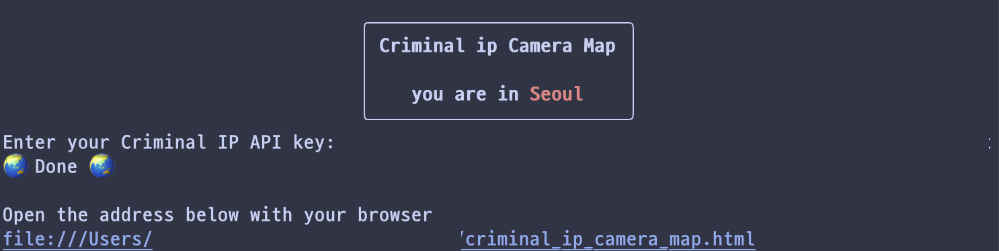
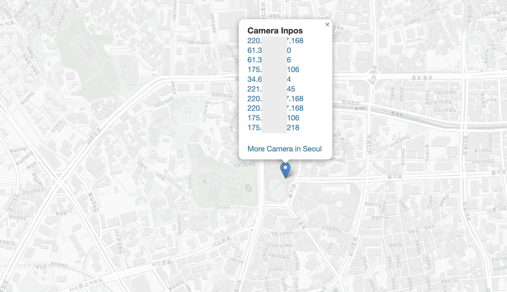

# <center>  🗺️ Criminal IP Camera Map 🗺️ </center>
  
  
  
  
### 📝 Description
---
- **Criminal IP Camera Map**: Find the IP Camera around you! You can check the location of IP Cameras on the map.
 
The Criminal IP Camera Map checks your location information to identify the cameras in and around the city where you are. You can check the detailed information of each camera, which is retrieved through the Criminal IP.
  
### 💻 Requirement
---
- You need the **API Key of the [Criminal ip](https://www.criminalip.io/)**.
  - If you do not have a Criminal ip API KEY, join Criminal IP and get the Criminal ip API key issued. **API Key itself is free**!
- The Python script was developed for **Python 3.12** version.
  
### 🏃 How to Run
 
- Execute the file
- Insert API Key from [Criminal ip](https://www.criminalip.io/)
- Enter the result file(address) to the browser
  
### 🛠️ Usage
---
```bash
git clone <this-repo's git url> ./Criminal_IP_Camera_Map
cd Criminal_IP_Camera_Map
 
pip3 install -r requirements.txt
python3 criminal_ip_map.py
```
### 📷 Screenshot
---
- Execute
  - 
- Result
  - 
